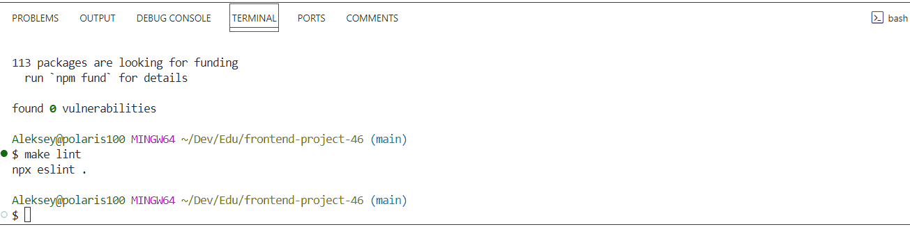
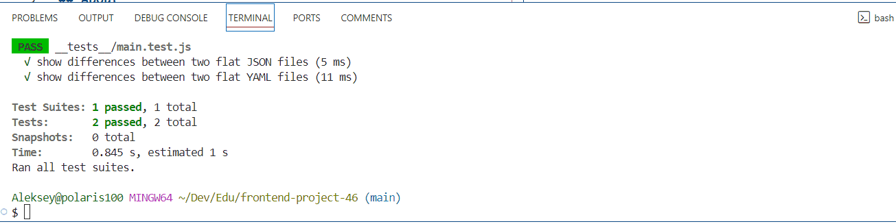

# genDiff

[](https://github.com/ayveezub/frontend-project-46/actions)

[](https://github.com/ayveezub/frontend-project-46/actions)
[](https://codeclimate.com/github/ayveezub/frontend-project-46/test_coverage)
[](https://codeclimate.com/github/ayveezub/frontend-project-46/maintainability)

## About

genDiff is a command line application that compares two configuration files and shows a difference.

- JSON: 

- YAML: 

## Requirements

- node >= 20.14.0

- npm >= 10.7.0

## Installation

```bash
make install
```

## Run tests

```bash
make test
```
