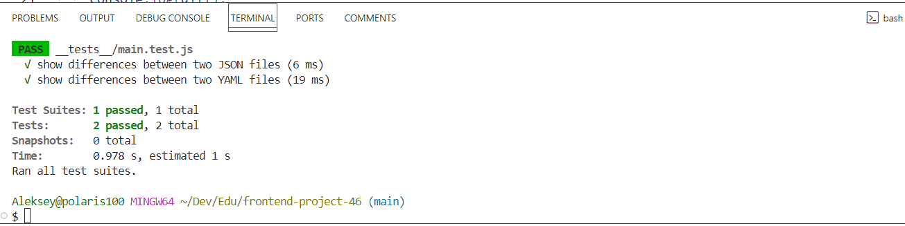
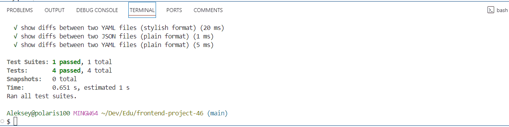

# genDiff

[](https://github.com/ayveezub/frontend-project-46/actions)

[](https://github.com/ayveezub/frontend-project-46/actions)
[](https://codeclimate.com/github/ayveezub/frontend-project-46/test_coverage)
[](https://codeclimate.com/github/ayveezub/frontend-project-46/maintainability)

## About

```
Usage: gendiff [options] <filepath1> <filepath2>

Compares two configuration files and shows a difference.

Options:
  -V, --version        output the version number
  -f, --format <type>  output format (choices: "stylish", "plain")
  -h, --help           display help for command
```

- JSON (*"stylish"* format): 

- YAML (*"plain"* format): 

## Requirements

- node >= 20.14.0

- npm >= 10.7.0

## Installation

```bash
make install
```

## Run tests

```bash
make test
```
